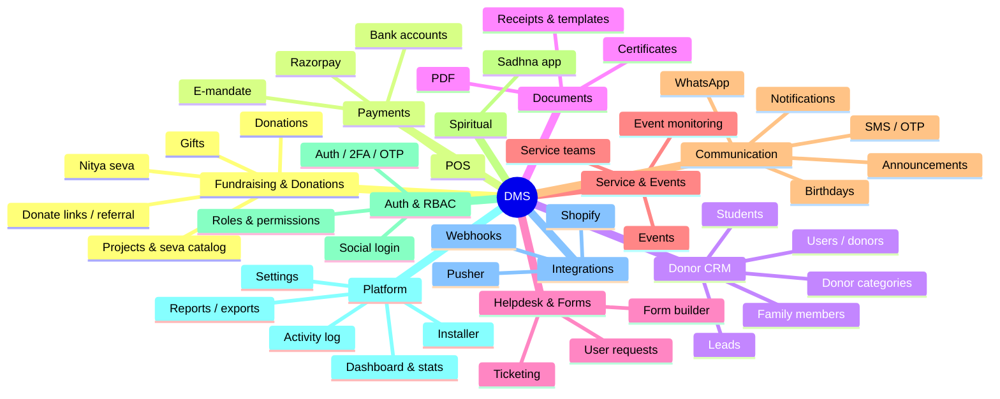

# CRM and Other Tools

The DMS is **not just a donation tool** — it bundles a donor CRM, fundraising platform, helpdesk, volunteer/event ops, communication channels, and a spiritual-practice app into one Laravel monolith. This is the complete module inventory, derived from the controllers, models, routes, views, and DB tables. Each item cites its evidence so it's verifiable; deep-dives link out to [[donation-flow]], [[payments]], [[auth-rbac]], [[domain-model]].

> [!note] How to read this
> "Evidence" = the controller(s) and/or table(s) that implement the module. A few modules are marked _(inferred)_ where the business purpose isn't explicit in code. See [[#Caveats]].

## Module map

## 1. Fundraising & Donations (core)
- **Donation management** — `DonationController`, `CashController`, `donation`; cash/cheque/online/e-mandate workflows → [[donation-flow]]
- **Public donation portals / personal fundraising links** — `UserLinkController` (`donate/{id}`, `ref/…`, `direct-donate`)
- **Fundraiser & referral program** — `ReferralSetting`, `referral_setting`, `fundraiser_id`, 10% incentive → [[donation-flow#⚠️ Fundraiser attribution]]
- **Projects / fundraising heads** — `ProjectController`, `project` (+ `team_leader_id`)
- **Categories & seva catalog** — `CategoryController`, `category`, `sub_category`, `seva_categories`
- **Nitya seva (recurring offerings)** — `NityaSevaTable`, `nitya_seva_table` → [[glossary#Nitya seva]]
- **Gift management** — `GiftController`, `gift_table`, `user_gift1`

## 2. Payments & Financial
- **Razorpay online payments** — `RazorpayController`, `RazorpayPaymentController`, `tbl_rozarpay` → [[payments#Razorpay (online)]]
- **E-mandate / recurring auto-debit (ACH/NACH)** — `eMandateController`, `emandate_bank_import` → [[payments#E-mandate (recurring debit)]]
- **POS (card machines)** — `POSController`, `pos_machines`
- **Bank accounts** — `BankAccount`, `bank_account`
- **Payment gateway config** — `PaymentGateway`, `payment_gateway`
- **Devotee payment** — `DevoteePayment` _(inferred: devotee-facing payment page)_
- **Crypto / payment security** — `payment/Crypto.php`, `E-mandate/Security.php`

## 3. Donor / Contact CRM
- **Users / donor records** — `Users\*`, `users`
- **Leads management** — `Lead`, `leads` (prospect tracking)
- **Donor categorization** — `Profile\DonorCategoryController`, `donor_categories`, `donor_category_helper`
- **Family members / households** — `FamilyMemberController`, `family_members`
- **Profiles** — `Profile\*` (details, avatar, login details, sessions)
- **Spiritual roles & departments** — `spiritual_roles`, `DepartmentController`, `department` / `departments`
- **Students** — `StudentController` (Excel import), `students` _(inferred: youth/education or student-donor program)_
- **Feedback** — `Feedback`, `feedback`

## 4. Receipts, Certificates & Documents
- **Receipt templates (configurable)** — `ReceiptTemplateController`, `receipt_templates`, `receipt_template_fields`
- **Certificates** — `CertificateSetting`, `certificate`, `certificate_status`
- **PDF generation** — `PdfController` + dompdf
- **Message/document templates** — `Template`, `TemplateSetting`, `template_setting`

## 5. Helpdesk, Forms & Requests
- **Ticketing / helpdesk** — `TicketController`, `tickets`, `ticket_form`, `ticket_comment`
- **Dynamic form builder** — `FormController`, `FormSettingController`, `form_setting` (generates the `TICKETS*` dynamic tables)
- **User requests / approval workflow** — `UserRequestController`, `user_requests`, `request_actions` (`RequestAction`)

## 6. Volunteer / Service & Events
- **Service teams / sevak (volunteer) management** — `ServiceController`, `service_team`, `service_status`, donation `assign_member`
- **Events** — `EventController`
- **Event monitoring / attendance** — `EventMonitorController`, `event_monitors`

## 7. Communication & Outreach
- **WhatsApp integration** — `whatsapp` views, `whatsapp_receipt`, `WHATSAPP_DAILY_DARSHAN_URL`
- **SMS / OTP (Pinbot)** — `OtpController`, `PINBOT_API_*`
- **Announcements** — `Announcement`, `announcements` (+ Vanguard Announcements plugin)
- **Notifications** — `Notification`, `notification`
- **Birthdays** — `BirthdayController` (greetings/reminders)
- **Subscriptions** — `SubscriptionController`, `Users\SubscriptionController` _(inferred: communication/recurring prefs)_

## 8. Spiritual programs
- **Sadhna (spiritual-practice) mobile app** — `Api\Sadhna\*`, `sadhna_daily_practices`, `sadhna_user_preferences` (chanting rounds, practices, progress graphs) → [[api-reference#Sadhna app]]

## 9. Authentication & Access control
- **Authentication** — `Web\Auth\*` (login, register, password, verification, social, mobile login)
- **2FA** — `TwoFactorController`, `TwoFactorTokenController`
- **OTP login** — `OtpController`
- **Social login** — `SocialAuthController`, `SocialLogin`, `social_logins`
- **RBAC (roles & permissions)** — `Authorization\{Roles,Permissions,RolePermissions}Controller`, `roles` / `permissions` / `permission_role` / `permission_user` → [[auth-rbac]]

## 10. Platform / Admin
- **Dashboard** — `DashboardController`
- **Stats / analytics** — `StatsController`
- **Reports & Excel exports** — `Reports\DonationReportController`, maatwebsite/excel
- **Activity log / audit** — Vanguard ActivityLog plugin, `user_activity`, `donation_log`, `devotee_log`
- **Settings & global config** — `SettingsController`, `settings`, `GlobalConstants`
- **Terms & conditions** — `TermController`, `term_conditions`
- **Image management** — `ImageController`, `images`
- **Log viewer** — `LogViewerController`
- **Installer / setup wizard** — `InstallController` (web + api)
- **Countries** — `CountriesController` (LaravelCountries plugin), `countries`

## 11. External integrations
- **Shopify** — `WebhookShopifyController`, `shopify_webook_category` (store orders → donations)
- **Generic webhooks** — `WebhookController`
- **Pusher** — real-time broadcasting

## Caveats

> [!warning] Verify before quoting
> - **Inferred modules** — `StudentController`, `SubscriptionController`, `DevoteePayment` are labeled by their methods/tables, not an explicit spec. Confirm their business purpose with the team.
> - **Legacy / duplicate controllers** exist (`CategoryController-new`, `OldCategoryController`, `oldMobileLogin`, `AuthController` vs `AuthApiController`), so the *live* module set may be slightly smaller than the file count suggests.
> - This reflects the codebase as of **2026-06-19** — re-run the controller/route/table sweep after major changes.

## See also
[[README\|Documentation Home]] · [[architecture-overview]] · [[domain-model]] · [[donation-flow]] · [[payments]] · [[auth-rbac]] · [[glossary]]
