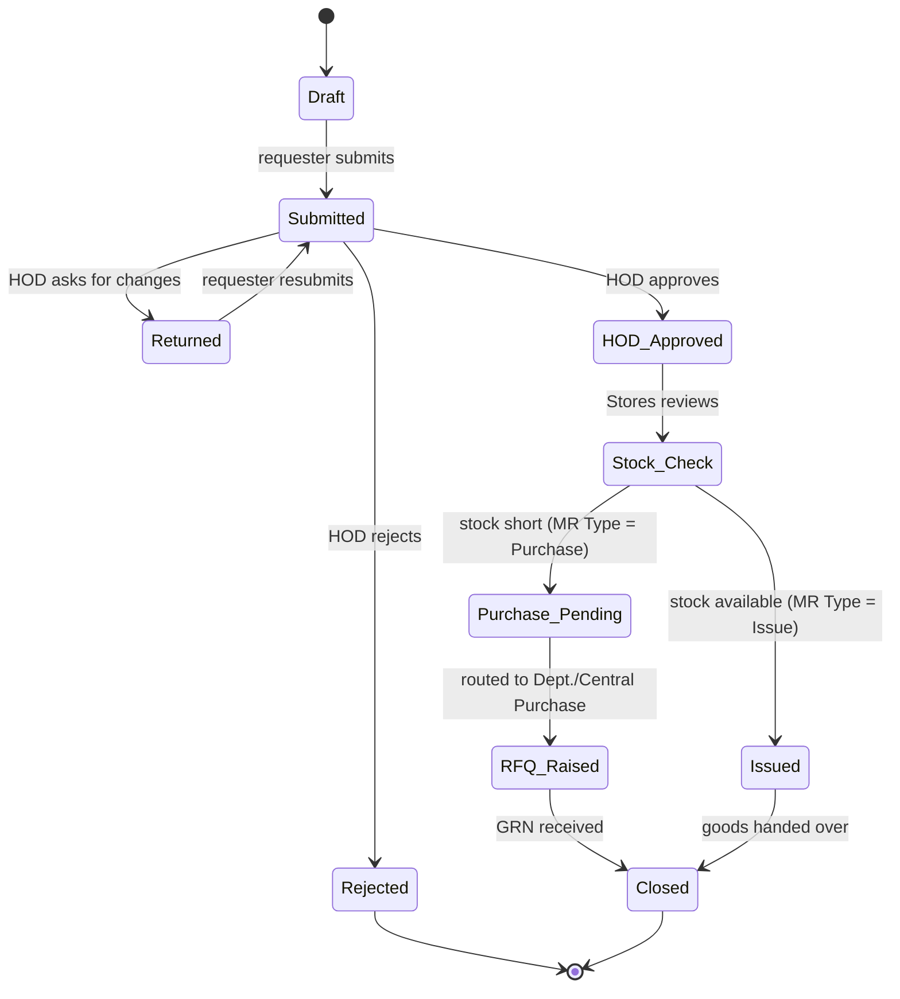

# Material Requisition (MR) Form

The **MR** is the first document in the procurement chain — a department's formal request for materials. It originates from the annual **Item List 2026** and drives everything downstream: [[procurement-process-flow.canvas|RFQ → Q → PO → TI → RE]] for external purchases, or a direct issue from stock.

> [!info] Where the MR appears in [[procurement-process-flow.canvas|the process flow]]
> The canvas uses the MR at three points. This is **one form** with a `MR Type` selector, not three documents.
>
> | Point in flow | `MR Type` | Next step |
> |---|---|---|
> | Phase 1 — Requisition to Receipt | **Purchase** | RFQ to vendors |
> | Phase 2 — Purchase Routing | **Purchase** | Departmental or Central Purchase |
> | Warehouse / Storage (after GRN) | **Issue** | Warehouse Central / Departmental, Store, or Dept. |

## Form layout

### 1. Header

| Field                       | Value                                                            |
| --------------------------- | ---------------------------------------------------------------- |
| **MR No.**                  | `MR-YYYY-NNNN` _(auto-generated, sequential per financial year)_ |
| **Date**                    |                                                                  |
| **MR Type**                 | ☐ Purchase  ☐ Issue (from stock)                                 |
| **Requesting Department**   |                                                                  |
| **Requested By**            | _(name / employee ID)_                                           |
| **Cost Centre / Project**   | _(links to `project` / `head_id` — see [[domain-model]])_        |
| **Priority**                | ☐ Normal  ☐ Urgent  ☐ Emergency                                  |
| **Required By Date**        |                                                                  |
| **Purpose / Justification** |                                                                  |

### 2. Line items

| #   | Item Code | Item Description | Specification | UoM | Qty Requested | Qty in Stock | Qty Approved | Est. Unit Cost | Est. Total | Remarks |
| --- | --------- | ---------------- | ------------- | --- | ------------- | ------------ | ------------ | -------------- | ---------- | ------- |
| 1   |           |                  |               |     |               |              |              |                |            |         |
| 2   |           |                  |               |     |               |              |              |                |            |         |
| 3   |           |                  |               |     |               |              |              |                |            |         |
|     |           |                  |               |     |               |              |              | **Total**      |            |         |

- **Item Code** must exist in **Item List 2026**. Items not in the list need a *New Item Request* attached and Central Purchase approval.
- **Qty in Stock** is filled by Stores, not the requester. If stock covers the request, the MR is converted to `MR Type = Issue`.

### 3. Delivery

| Field | Value |
|---|---|
| **Deliver To** | ☐ Warehouse Central  ☐ Warehouse Departmental  ☐ Store  ☐ Dept. (direct) |
| **Delivery Location / Room** | |
| **Contact Person & Phone** | |

### 4. Approvals

| Role | Name | Signature | Date | Decision |
|---|---|---|---|---|
| Requested by | | | | — |
| Department Head (HOD) | | | | ☐ Approved ☐ Rejected ☐ Returned |
| Stores (stock check) | | | | ☐ Issue from stock ☐ Purchase required |
| Purchase (Departmental / Central) | | | | ☐ Approved ☐ Rejected |
| Accounts (budget check) _— if Est. Total > limit_ | | | | ☐ Approved ☐ Rejected |

### 5. Office use only

| Field | Value |
|---|---|
| **Routing** | ☐ Departmental Purchase  ☐ Central Purchase |
| **RFQ No.** | |
| **PO No.** | |
| **GRN No.** | |
| **Closed On** | |

## Field specification

For whoever builds this in the DMS. Types follow the Laravel conventions already used in [[domain-model]].

| Field | Type | Required | Validation / Notes |
|---|---|---|---|
| `mr_no` | string(12), unique | auto | Format `MR-YYYY-NNNN`; sequence resets each financial year (Apr–Mar). |
| `mr_date` | date | ✅ | Defaults to today; cannot be future-dated. |
| `mr_type` | enum `purchase\|issue` | ✅ | Stores may flip `purchase → issue` during stock check. |
| `department_id` | FK → departments | ✅ | |
| `requested_by` | FK → `users.id` | ✅ | Defaults to logged-in user. See [[auth-rbac]]. |
| `project_id` / `head_id` | FK → `project` | ✅ | Budget is checked against this head. |
| `priority` | enum `normal\|urgent\|emergency` | ✅ | `emergency` requires a justification ≥ 50 chars and notifies Central Purchase immediately. |
| `required_by` | date | ✅ | Must be ≥ `mr_date`. Warn if < 7 days and priority is `normal`. |
| `purpose` | text | ✅ | |
| `deliver_to` | enum `warehouse_central\|warehouse_dept\|store\|dept` | ✅ | Matches the four destinations in the Warehouse / Storage group of the canvas. |
| `status` | enum | auto | See [[#Workflow states]]. |
| **Line item** | | | Table `mr_items`, FK `mr_id`. Minimum 1 row. |
| `item_id` | FK → item list | ✅ | Must be an active item in Item List 2026. |
| `specification` | string(255) | ◻ | |
| `uom` | string(10) | ✅ | Pulled from item master; read-only. |
| `qty_requested` | decimal(10,2) | ✅ | > 0. |
| `qty_in_stock` | decimal(10,2) | Stores | Filled at stock check, read-only for requester. |
| `qty_approved` | decimal(10,2) | Approver | 0 < value ≤ `qty_requested`. |
| `est_unit_cost` | decimal(12,2) | ◻ | Prefilled from last PO price if known. |
| `est_total` | computed | — | `qty_approved × est_unit_cost` (falls back to `qty_requested` before approval). |

## Workflow states

> [!warning] Budget gate
> When `est_total` exceeds the department's approval limit, the MR cannot move past `HOD_Approved` until **Accounts** signs off. The limit lives per cost centre — don't hard-code it.

## Business rules

1. **One MR per department per need.** Don't mix cost centres on one MR; split them.
2. **Partial approval is allowed** — `qty_approved` may be less than requested; the requester is notified of the difference.
3. **An MR is immutable after `Submitted`.** Changes require *Return* by the HOD, which creates a new revision (`MR-2026-0042-R1`).
4. **Emergency MRs** skip the Stores stock check only if Stores confirms nil stock by phone; the confirmation is noted in *Remarks*.
5. **Closure**: an MR of type *Purchase* closes on GRN; of type *Issue* closes on hand-over signature.

## Related

- [[procurement-process-flow.canvas]] — the full document chain
- [[Material Requisition|Blank MR template]] — insert via *Templates → Insert template*
- [[glossary]] — add `MR`, `RFQ`, `GRN` when the procurement module is confirmed
