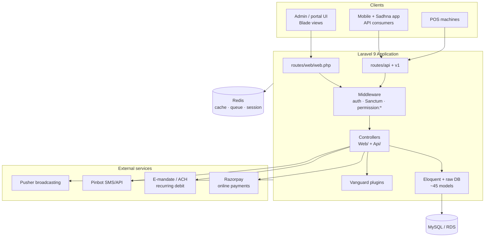

# Architecture Overview

The **DMS** is a Laravel 9 monolith (PHP `^8.0.2`) for managing donations, donors, projects/seva, receipts, and reporting across ISKCON temples. See [[glossary]] for domain terms and [[infrastructure]] for how one codebase serves many temples.

> [!note] Built on Vanguard
> The app is built on the **[Vanguard](https://vanguardapp.io)** Laravel starter kit — its fingerprints are the `vanguardapp/*` plugins ([[#Plugins]]) and the `Auth/`, `Authorization/`, `Users/`, `Profile/` controller structure plus the roles/permissions model. See [[auth-rbac]]. Newer feature areas (Sadhna app, receipt templates, service teams) were added on top.

## High-level shape

## Request lifecycle

1. **Route** — `routes/web/web.php` (server-rendered) or `routes/api/*` (JSON). Many web routes carry a `->name('permission:…')` guard.
2. **Middleware** — session auth (web) or **Laravel Sanctum** tokens (API); permission checks; see [[auth-rbac]].
3. **Controller** — `app/Http/Controllers/Web/` or `…/Api/`.
4. **Data** — a mix of **Eloquent models** and **raw `DB::` queries** (legacy style; see the warning below).
5. **Response** — Blade view, PDF (dompdf), Excel export (maatwebsite/excel), or JSON.

## Code layout

| Path | Purpose |
|------|---------|
| `app/Http/Controllers/Web/` | Blade controllers — dashboard, donations, [[donation-flow\|cash/cheque]], POS, reports, users |
| `app/Http/Controllers/Api/` | JSON API — auth, donations, categories, stats, [[api-reference#Sadhna app\|Sadhna]] |
| `app/Models/` | ~45 Eloquent models — see [[domain-model]] |
| `routes/web/`, `routes/api/` | Route definitions (+ `api/v1/`) |
| `plugins/` | Vanguard path packages: ActivityLog, Announcements, LaravelCountries |
| `payment/`, `rozarpay/`, `E-mandate/` | Payment + recurring-mandate integration — see [[payments]] |
| `config/`, `database/`, `resources/` | Laravel config, migrations/seeders, Blade views/assets |

## Key dependencies

| Package | Used for |
|---------|----------|
| `laravel/sanctum` | API token auth ([[api-reference]]) |
| `barryvdh/laravel-dompdf` | PDF receipts/certificates |
| `maatwebsite/excel` | Report exports |
| `spatie/laravel-query-builder` | Filter/sort on API list endpoints |
| `phpmailer/phpmailer` | Email |
| `spatie/db-dumper` | DB backups |

## Plugins

Local Composer **path packages** (auto-discovered on `composer install`):
- **ActivityLog** — `vanguardapp/activity-log`, user activity audit
- **Announcements** — `vanguardapp/announcements`
- **LaravelCountries** — `webpatser/laravel-countries`, ISO country data

> [!warning] Legacy data-access style
> Much of the donation code uses **raw `DB::` queries with string concatenation** (see [[donation-flow]] and `CashController`). This means **no enforced foreign keys** on most `donation` columns and **SQL-injection exposure** where request values are concatenated. Treat this code with care; prefer parameter binding / Eloquent in new code. Details in [[domain-model#Notes for contributors / AI]].

## See also
[[domain-model]] · [[donation-flow]] · [[payments]] · [[auth-rbac]] · [[infrastructure]]
