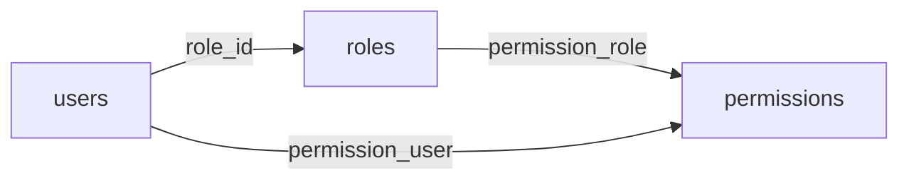

# Authentication & Authorization (RBAC)

DMS auth comes from the **[Vanguard](https://vanguardapp.io)** Laravel starter, extended with OTP, 2FA, social login, and a newer Sanctum-based API for the [[api-reference#Sadhna app|Sadhna app]]. The data model is in [[domain-model#Identity, auth & RBAC]].

## Mechanisms

| Surface | Mechanism |
|---------|-----------|
| Web (admin/portal) | Session-based login (`Auth\LoginController`), OTP (`OtpController`), 2FA (`TwoFactorController`) |
| API (general) | **Laravel Sanctum** tokens (`Api/Auth/*`, `AuthApiController`) |
| API (Sadhna app) | Sanctum + OTP login (`Api/Sadhna/Auth/*`) |
| Social | `social_logins` table, `SocialLoginController` |

## Roles & permissions model

Classic role/permission with both **role-based** and **direct user** grants:



- `roles` ← `users.role_id` (FK). Donors are created with **`role_id = 2`** (see [[donation-flow#A cash donation (portal) — sequence]]).
- `permissions` granted to roles via `permission_role`, or to individuals via `permission_user`.
- `spiritual_roles` (`users.spiritual_role` FK) and `department` model the devotee org structure — distinct from access-control roles.

These are **real DB-enforced foreign keys** (unlike most `donation` columns) — see [[domain-model#Identity, auth & RBAC]].

## Route permission guards

Many web routes attach a permission via the route **name** convention:

```php
Route::get('donation-info/', 'DonationController@donation_info')
    ->name('permission:permissions.manage');

Route::get('approve-donation', 'CashController@approve_donation')
    ->name('permission:approve.donation');
```

Observed permission keys include: `permissions.manage`, `donations`, `donation.from.portal`, `approve.donation`, `gift.list`. When adding a protected route, follow the same `->name('permission:<key>')` pattern and ensure the permission is seeded (`PermissionsSeeder`).

> [!note] Seeded roles & permissions
> Initial roles/permissions/users come from `database/seeders/` — `RolesSeeder`, `PermissionsSeeder`, `UserSeeder`. See [[development#First-time setup]].

## Profile, 2FA & sessions (API)

The API exposes self-service account management (Vanguard-style):

| Endpoint | Purpose |
|----------|---------|
| `GET/PATCH me`, `me/details` | View / update own profile |
| `POST me/avatar`, `DELETE me/avatar` | Avatar management |
| `PUT me/2fa`, `POST me/2fa/verify`, `DELETE me/2fa` | Two-factor auth |
| `GET me/sessions` | Active sessions |

Admins manage other users under `users/{user}/…` (avatar, 2fa, sessions). Full list in [[api-reference#Account & users]].

## See also
[[domain-model]] · [[api-reference]] · [[architecture-overview]] · [[donation-flow]]
