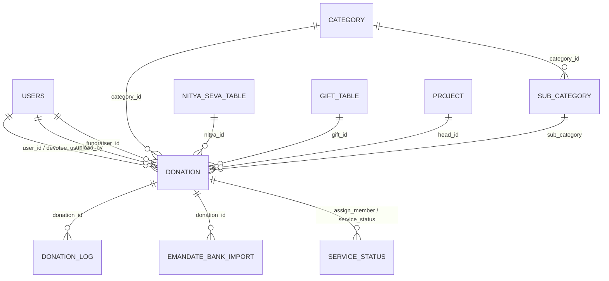
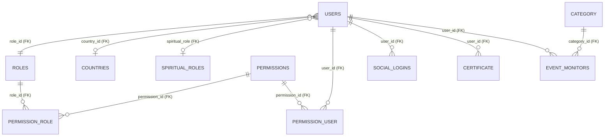

# Domain Model

Reflects the **actual schema** in `database/migrations/` — the base `2018_09_24_234659_create_donation_base.php` plus incremental migrations. The `donation` table is the hub. See [[glossary]] for what these terms mean and [[donation-flow]] for how rows get created.

> [!warning] Logical references, not enforced FKs
> Most `donation` "foreign keys" are **plain nullable integer columns with no DB constraint**. Joins are by convention. Only a handful of real foreign keys exist (see [[#Identity, auth & RBAC]]). Don't assume referential integrity.

## Donation-centric view

### `donation` — key columns

| Column(s) | Meaning |
|-----------|---------|
| `id` | PK |
| `user_id`, `devotee_user_id` | Donor / devotee → `users` |
| `upload_by` | User who entered the record |
| `category_id`, `sub_category` | Classification → `category` / `sub_category` |
| `head_id` | Project/fund head → `project` |
| `nitya_id`, `gift_id`, `package_id` | Nitya seva / gift / package references |
| `fundraiser_id` | **Fundraiser attribution** — see warning below |
| `collecting_person_name`, `facilitator_person_name`, `counselor_person_name` | Attribution names (free-text) |
| `amount`, `currency`, `payment_method`, `payment_mode`, `payment_status` | Money + payment ([[payments]]) |
| `order_id`, `bank_ref_no`, `transaction_id`, `tracking_id` | Gateway references |
| `prefix_receipt`, `receipt_number`, `cash_receipt_number`, `whatsapp_receipt` | Receipting |
| `status`, `workflow`, `gift_status`, `certificate_status` | Workflow state — see [[donation-flow#Statuses & workflows]] |
| `assign_member`, `service_status` | Service-team assignment (added 2026-04) |
| `webhook`, `pg_status`, `shopify_webook_category` | Integration flags (incremental migrations) |

> [!danger] ⚠️ Fundraiser attribution is sensitive
> A known class of bugs swaps **fundraiser vs. collector** and misroutes the 10% incentive. The root cause was a pre-existing `->get()` bug in `CashController` (Sep 2025), not a recent PR. Review attribution carefully when touching `fundraiser_id` / `collecting_person_name`. Full context in [[donation-flow#⚠️ Fundraiser attribution]].

## Identity, auth & RBAC

> [!note] These ARE real DB-enforced foreign keys
> Defined at the end of the base migration: `users.role_id`→`roles`, `users.country_id`→`countries`, `users.spiritual_role`→`spiritual_roles`, `permission_role`, `permission_user`, `social_logins.user_id`, `certificate.user_id`, and `event_monitors` (category + user). This RBAC structure comes from [[auth-rbac|Vanguard]].

## Entity reference

| Table / Model | Role |
|---------------|------|
| `donation` / `Donation` | Central transaction record ([[donation-flow]]). |
| `donation_log`, `devotee_log` | Audit trails (`DonationLog`, `DevoteeLog`). |
| `project` / `Project` | Fund/cause a donation supports; `team_leader_id` added 2026-03. |
| `category` / `sub_category` | Classification (`Category`, `SubCategory`). |
| `nitya_seva_table` / `NityaSevaTable` | Recurring [[glossary#Nitya seva\|seva]] offerings. |
| `gift_table`, `user_gift1` / `GiftTable` | Donation gifts. |
| `receipt_templates`, `receipt_template_fields` | Configurable receipts (added 2026-01). |
| `certificate` / `Certificate` | Donor certificates. |
| `bank_account`, `emandate_bank_import` | Banking + recurring [[payments#E-mandate (recurring debit)\|e-mandate]] imports. |
| `payment_gateway`, `tbl_rozarpay` | Gateway config + [[payments#Razorpay (online)\|Razorpay]] txns. |
| `pos_machines` / `PosMachine` | On-site POS devices. |
| `service_team`, `service_status` | Service-team assignment (added 2026-04). |
| `users`, `roles`, `permissions`, `permission_role`, `permission_user` | Auth & RBAC ([[auth-rbac]]). |
| `spiritual_roles`, `department` | Org/devotee structure. |
| `leads`, `students` | CRM-style records. |
| `sadhna_daily_practices`, `sadhna_user_preferences` | [[api-reference#Sadhna app\|Sadhna]] tracking (added 2025-09). |
| `settings`, `form_setting`, `template_setting`, `referral_setting` | Configurable behavior. |
| `tickets`, `ticket_form`, `ticket_comment` | Ticketing. |

## Notes for contributors / AI

> [!tip] Working with this schema
> - Most `donation` FKs are **unconstrained nullable integers** — joins are by convention, integrity is not enforced.
> - The base migration is **frozen history** — extend the schema with a new dated migration.
> - Donation writes are largely **raw SQL** in `CashController` — see the legacy-style warning in [[architecture-overview#Plugins]].

## See also
[[donation-flow]] · [[payments]] · [[auth-rbac]] · [[architecture-overview]] · [[glossary]]
