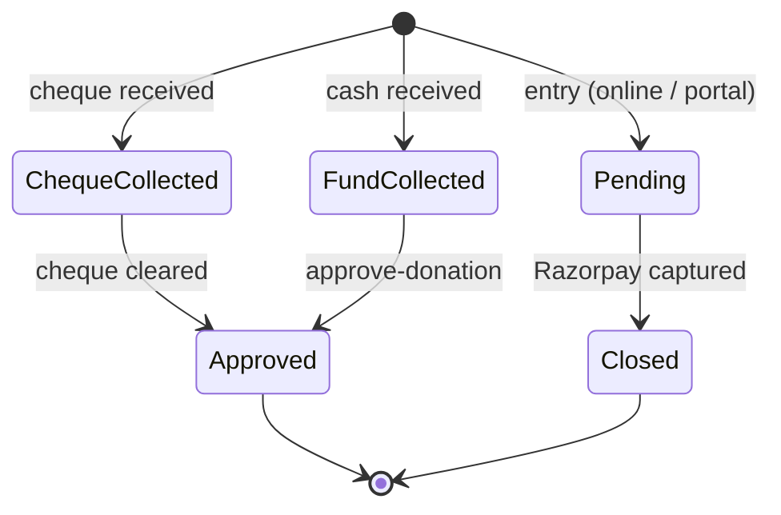
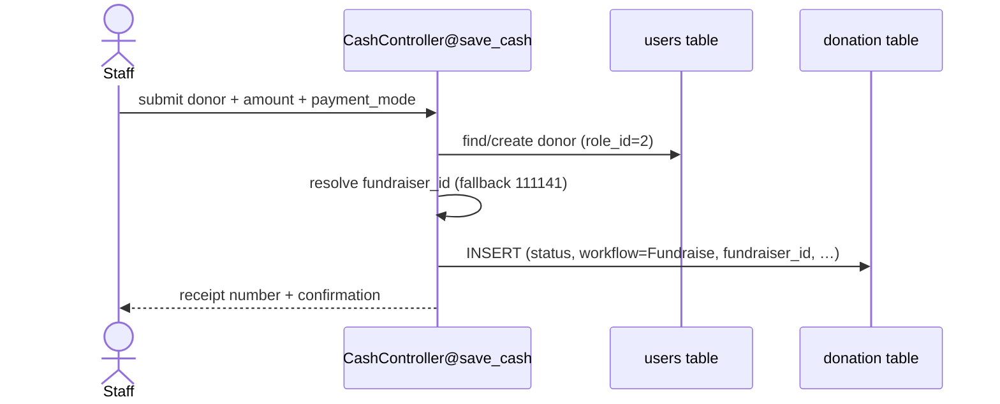
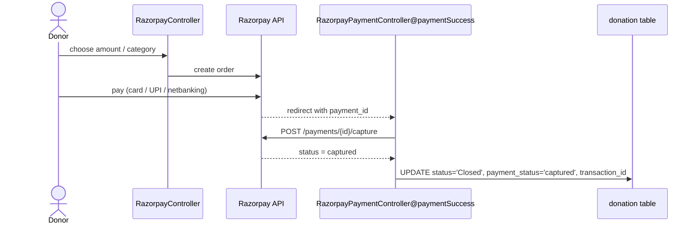

# Donation Flow

How a donation moves from entry to a closed, receipted record. The `donation` table is the hub ([[domain-model#`donation` — key columns]]); payment specifics are in [[payments]].

## Entry points

| Channel | Route(s) | Controller |
|---------|----------|------------|
| **Portal / back-office** (cash, cheque, e-mandate) | `donation-from-portal`, `save-cash`, `save-cash1` | `Web/CashController` |
| **Online** (card/UPI/netbanking) | `razorpay/*`, `/payment-success` | `Web/RazorpayController`, `RazorpayPaymentController` |
| **Public donate links** (referral / direct) | `donate/{id}`, `ref/{…}`, `direct-donate/` | `Web/UserLinkController` |
| **E-mandate bank import** | `emandate-import` | `eMandateController` |
| **POS machine** | POS routes | `Web/POSController` |
| **API** | `donations` (v1) | `Api/DonationController` |

## Statuses & workflows

A donation carries both a `workflow` and a `status` (free-text strings, set in `CashController` / `RazorpayPaymentController`):

| `workflow` | Meaning |
|------------|---------|
| `Fundraise` | Collected by a fundraiser (cash/cheque/online) |
| `Emandate` | Recurring auto-debit mandate |

| `status` | Set when |
|----------|----------|
| `Pending` | Created, awaiting payment/approval (`payment_status='Pending'`) |
| `Fund Collected` | Cash received |
| `Cheque Collected` | Cheque received (`cheque_clear='No'` until cleared) |
| `Closed` | Razorpay payment **captured** (`payment_status='captured'`) — see [[payments#Razorpay (online)]] |

> [!note] Status strings are not an enum
> Statuses are plain strings written inline across many `DB::table('donation')->insert([...])` calls in `CashController`. There's no central state machine — grep for the literal strings when changing behavior.

## A cash donation (portal) — sequence

## An online donation — sequence

## ⚠️ Fundraiser attribution

> [!danger] The most sensitive logic in the system
> Every donation records who gets credit/incentive via `fundraiser_id` (+ free-text `collecting_person_name`, `facilitator_person_name`, `counselor_person_name`).
> - In `CashController`, when a donor has no fundraiser, `fundraiser_id` **falls back to `111141`** (a house/default account).
> - A confirmed bug class **swaps fundraiser vs. collector**, diverting the **10% incentive**. Root cause: a pre-existing hardcopy `->get()` bug in `CashController` (Sep 2025) — *not* a recent PR.
> - Donor records are created with `role_id=2` and `register_from='fundraiser'`.
>
> **Before changing attribution:** trace every `fundraiser_id` assignment in `CashController`, and check `edit-fundraiser` / `edit-fundraisername` (`DonationController`). Cross-reference [[domain-model#`donation` — key columns]].

## Editing & approval

| Action | Route → handler |
|--------|-----------------|
| Edit a cash donation | `edit-cash-donation/{id}`, `edit_cash_submit` → `CashController` |
| Delete a cash donation | `delete-cash-donation/{id}` → `CashController` |
| Change fundraiser | `edit-fundraiser`, `edit-fundraisername` → `DonationController` |
| Approve donation | `approve-donation` → `CashController@approve_donation` (perm `approve.donation`) |
| Cheque clearing | `cheque-status` → `CashController@cheque_status` |
| Update transaction id | `update-transid` → `DonationController` |

Many of these routes are guarded by `->name('permission:…')` — see [[auth-rbac#Route permission guards]].

## Audit

Changes are recorded in `donation_log` (`action`, `result`, `action_by`) and donor changes in `devotee_log`. See [[domain-model#Entity reference]].

## See also
[[payments]] · [[domain-model]] · [[auth-rbac]] · [[glossary]]
