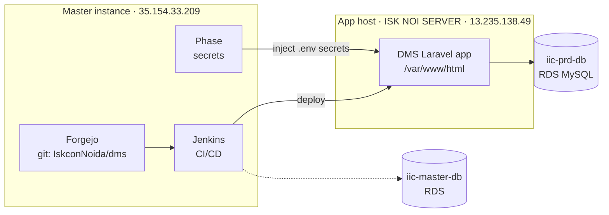
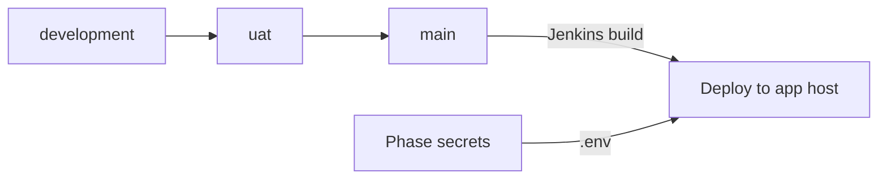

# Infrastructure & Deployment

The DMS is a **single shared codebase deployed to many temples** (Greater Noida West, Whitefield, …). Each deployment differs only by its `.env` and database — not a separate repo per temple. This is the most important non-obvious fact about the system; it's recorded as [[decisions/0001-shared-codebase-per-temple-env|ADR-0001]].

## Hosts

| Host | Address | Runs |
|------|---------|------|
| Master instance | `35.154.33.209` | Forgejo (git), Jenkins (CI/CD), Phase (secrets) |
| App host (ISK NOI SERVER) | `13.235.138.49` | DMS application at `/var/www/html` |

## Databases

- **iic-prd-db** — production RDS MySQL (application data).
- **iic-master-db** — master RDS.

## Deploy pipeline

1. Code lives in **Forgejo** (`IskconNoida/dms`). Branch flow: `development` → `uat` → `main`.
2. **Jenkins** builds and deploys to the app host(s).
3. **Phase** injects per-temple secrets / `.env` at deploy time.

## Per-temple configuration

Temple-specific behavior comes entirely from `.env` (see `.env.example` and [[development#`.env` you must set]]):

| Key | Effect |
|-----|--------|
| `NATIVE_TEMPLE_CITY`, `ADDRESS_LINE_1/2` | Temple identity on receipts |
| `RECEIPT_PREFIX`, `USER_PREFIX` | ID/receipt numbering (e.g. `ISK/NOI/`) |
| `CARE_EMAIL`, `CONNECT_EMAIL` | Contact addresses |
| `PINBOT_API_KEY`, `PINBOT_API_V2/V3_URL` | SMS / messaging |
| `PAYMENT_REDIRECT_URL`, `DONATION_RECEIPT_IMAGE_URL` | Payment + receipt assets ([[payments]]) |
| `PUSHER_APP_*` | Real-time broadcasting |
| Social URLs | Footer / links |

> [!danger] Don't confuse DMS with myseva
> **myseva** (`myseva.iskconnoida.org`) is a *separate* Leantime/Docker codebase on its own AWS host. Do not debug it from this repo or its logs.

## Runtime drivers

Production uses Redis for cache/queue/session; `.env.example` ships local-safe fallbacks (`CACHE_DRIVER=array`, `QUEUE_DRIVER=sync`, `SESSION_DRIVER=database`). See [[development#Drivers (local-friendly defaults)]].

## See also
[[architecture-overview]] · [[development]] · [[decisions/0001-shared-codebase-per-temple-env]]
