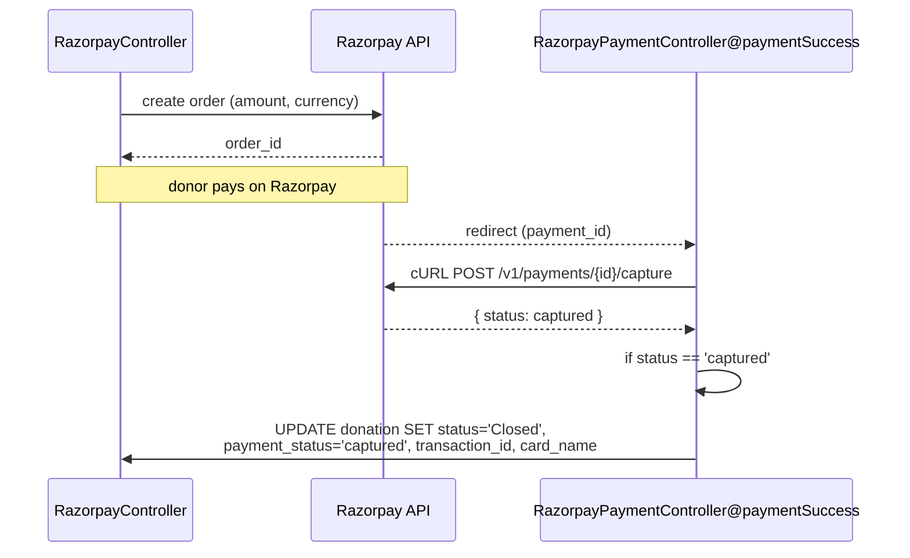

# Payments

DMS takes money two ways: **Razorpay** for one-off online payments, and **e-mandate / ACH** for recurring auto-debit. Both ultimately write to the `donation` table — see [[donation-flow]] and [[domain-model#`donation` — key columns]].

## Razorpay (online)

Code lives in `app/Http/Controllers/Web/RazorpayController.php`, `RazorpayPaymentController.php`, and the helper `rozarpay/razorpay-api.php`. Transaction records go to `tbl_rozarpay` (`TblRozarpay` model); gateway config in `payment_gateway` (`PaymentGateway`).

Key behavior in `paymentSuccess`:
- Captures the payment via `cURL` to `https://api.razorpay.com/v1/payments/{id}/capture`.
- On `status == 'captured'` → sets the donation `status='Closed'`, `payment_status='captured'`, stores `transaction_id`, `card_name`, `status_code`.
- `payment_method` is recorded as `"Generic razorpay"`.

| Route | Handler | Purpose |
|-------|---------|---------|
| `razorpay/payment` | `RazorpayController` (view) | Payment page |
| `/payment-success` | `RazorpayPaymentController@paymentSuccess` | Capture + close donation |
| `rozarpay-status/{id}` | `RazorpayController@rozarpay_status_api` | Reconcile status |
| `rozarpay-recall_api/{id}` | `RazorpayController@rozarpay_recall_api` | Re-query a payment |
| `save-donation`, `save-cash` | `RazorpayController@failure` | Failure handling |

> [!warning] Capture/verify is manual
> The flow calls Razorpay's **capture** endpoint directly via cURL and branches on the returned `status` string, and updates the donation with **raw concatenated SQL**. There is no Razorpay **webhook-signature verification** in this path — reconciliation relies on the redirect + `rozarpay-status`. Be careful changing it; validate amounts server-side.

## E-mandate (recurring debit)

For recurring/auto-debit donations. Code: `E-mandate/` (`index.php`, `rozarpay.php`, `Security.php`) and `eMandateController`. Imported bank files land in `emandate_bank_import` (`EmandateBankImport` model), linked to `donation` via `donation_id` (and `nitya_id` for [[glossary#Nitya seva|nitya seva]]).

| Route | Handler | Purpose |
|-------|---------|---------|
| `emandate-import` (GET) | `eMandateController@emandate_import_data` | Import screen |
| `emandate-import` (POST) | `eMandateController@emandate_import` | Process bank file |

Donations on this path use `workflow='Emandate'` (see [[donation-flow#Statuses & workflows]]). The `emandate_bank_import` table carries ACH fields (`ACH_transaction_code`, `destination_account_type`, control fields) from the bank's settlement file.

## Crypto

`payment/Crypto.php` exists for payment-related encryption/signing helpers. Treat keys (`ENCRYPTION_KEY`, `CIPHER`) as secrets — see [[development#`.env` you must set]].

## Configuration

Gateway keys and redirect URLs are per-temple via `.env` (`PAYMENT_REDIRECT_URL`, `DONATION_RECEIPT_IMAGE_URL`, plus Razorpay credentials) — see [[infrastructure#Per-temple configuration]].

## See also
[[donation-flow]] · [[domain-model]] · [[infrastructure]] · [[glossary]]
